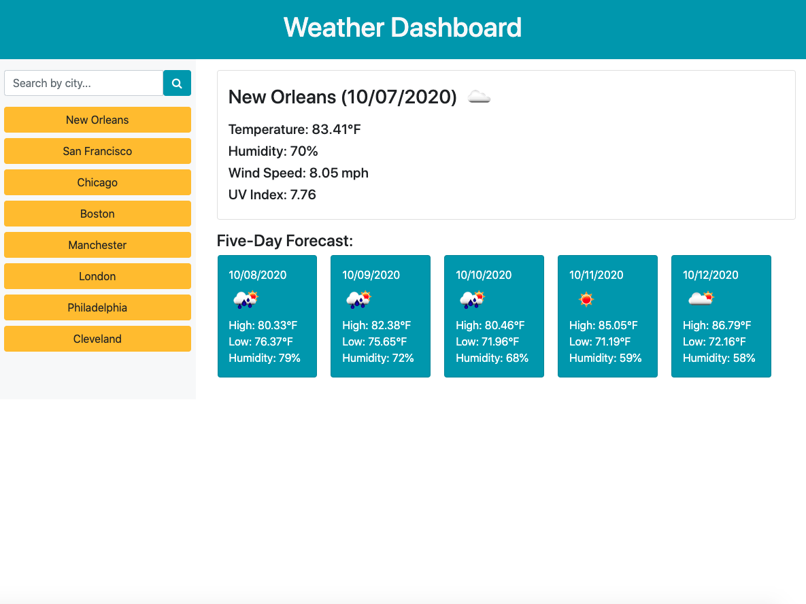

# Weather Dashboard

This web application allows users to search for weather data for a specific city/place using the OpenWeather API.

The application shows current weather and a five day forecast including temperature, humidity, wind speed, and UV index, and makes use of the weather icons for a clearer user interface. When a user searches for a city, that city is saved to local storage and a button is created for easier access to the weather results the next time they use the application.

[View the deployed web application.](https://dandandanoneil.github.io/weather-dashboard/index.html)

## Screenshot

  
## License
[MIT License](http://opensource.org/licenses/mit-license.php)

> Written with [StackEdit](https://stackedit.io/).
